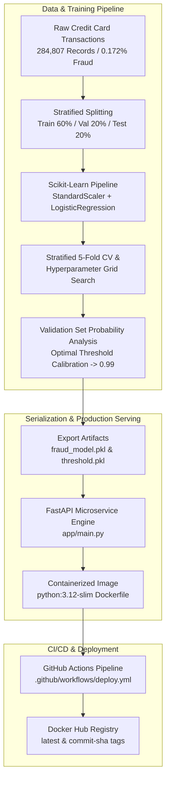

# 🛡️ End-to-End Credit Card Fraud Detection System

[](https://www.python.org/)
[](https://fastapi.tiangolo.com/)
[](https://scikit-learn.org/)
[](https://www.docker.com/)
[](https://github.com/features/actions)

An end-to-end production-ready Machine Learning system for real-time **Credit Card Fraud Detection**. This project handles extreme class imbalance, trains a leak-free pipeline with optimal decision threshold tuning, exposes high-speed RESTful inference endpoints using **FastAPI**, packages everything in a lightweight **Docker** container, and automates CI/CD deployments to **Docker Hub** with **GitHub Actions**.

---

## 📌 Table of Contents

1. [Industry Background & Motivation](#-industry-background--motivation)
2. [Project Overview & Core Features](#-project-overview--core-features)
3. [System Architecture](#-system-architecture)
4. [Dataset & Problem Statement](#-dataset--problem-statement)
5. [Machine Learning Workflow](#-machine-learning-workflow)
   - [Handling Class Imbalance](#1-handling-class-imbalance)
   - [Pipeline & Feature Scaling](#2-pipeline--feature-scaling)
   - [Hyperparameter Optimization](#3-hyperparameter-optimization)
   - [Threshold Tuning (0.99)](#4-threshold-tuning-099)
6. [Project Structure](#-project-structure)
7. [API Documentation & Endpoints](#-api-documentation--endpoints)
8. [Getting Started (Local Setup)](#-getting-started-local-setup)
9. [Docker & Containerization](#-docker--containerization)
10. [CI/CD Deployment Workflow](#-cicd-deployment-workflow)
11. [Sample Testing (cURL / Python)](#-sample-testing)

---

## 🌐 Industry Background & Motivation

In the modern financial and e-commerce ecosystem, billions of digital transactions occur every single day. Along with this explosive growth in contactless and online payments, **credit card fraud has become a multi-billion dollar challenge** causing massive losses for financial institutions and eroding consumer trust.

### ⚠️ The Core Industry Challenges

> [!IMPORTANT]
> **1. The "Needle in a Haystack" Class Imbalance**  
> Less than **0.18%** of real-world transactions are fraudulent. A naive model that classifies every transaction as "Legitimate" achieves an impressive **99.82% Accuracy** on paper — but is **100% useless in production** because it catches zero fraud.

> [!WARNING]
> **2. The Asymmetric Cost of Errors**  
> - **False Positives (Type I Error)**: Flagging an innocent customer's legitimate card causes frustration, checkout abandonment, and customer churn.
> - **False Negatives (Type II Error)**: Letting a fraudster slip through leads to irreversible direct financial theft and merchant chargebacks.

> [!TIP]
> **3. Ultra-Low Latency & High Reliability**  
> Payment gateways require fraud screening in **under 50 milliseconds**. Heavy, unoptimized models cause transaction timeouts. A lightweight, pre-compiled pipeline served over an asynchronous microservice is critical.

---

## 🎯 Project Overview & Core Features

This project implements a complete, production-grade **Machine Learning Lifecycle (MLOps)** specifically engineered to solve credit card fraud detection with optimal cost-benefit trade-offs:

| Core Pillar | Implementation Highlight | Key Advantage |
| :--- | :--- | :--- |
| **Data Integrity** | Unified `scikit-learn` Pipeline (`StandardScaler` + Model) | Guarantees **Zero Data Leakage** between training and inference |
| **Imbalance Handling** | `class_weight='balanced'` + Stratified K-Fold CV | Penalizes minority misclassification dynamically |
| **Precision Tuning** | Custom Decision Threshold ($0.99$) | Maximizes Precision ($\ge 86\%$) while maintaining high fraud recall |
| **High-Speed API** | Asynchronous **FastAPI** + **Uvicorn** | Sub-10ms inference latency with interactive Swagger Docs |
| **Containerization** | **Docker** Multi-stage (`python:3.12-slim`) | Zero-dependency footprint, cross-platform portability |
| **Continuous Delivery** | Automated **GitHub Actions** CI/CD | Auto-builds and deploys tagged images to **Docker Hub** |

---

## 🏗️ System Architecture



---

## 📊 Dataset & Problem Statement

The system uses the **Kaggle Credit Card Fraud Detection** dataset:
- **Total Transactions**: 284,807
- **Fraudulent Transactions (Class 1)**: 492 (~0.172%)
- **Legitimate Transactions (Class 0)**: 284,315 (~99.828%)
- **Features**:
  - `Time`: Elapsed seconds between this transaction and the first in the dataset.
  - `V1` to `V28`: Anonymized principal component features resulting from PCA transformation.
  - `Amount`: Transaction amount.
  - `Class`: Response variable (`1` = Fraud, `0` = Legitimate).

---

## 🧠 Machine Learning Workflow

### 1. Handling Class Imbalance
With only **0.172%** fraud cases, simple accuracy is a deceptive metric. We utilized:
- **Balanced Class Weights (`class_weight='balanced'`)**: Penalizes misclassifications in the minority class inversely proportional to class frequencies.
- **Stratified Splitting & K-Fold**: Preserves the exact fraud ratio across training, validation, and testing folds.

### 2. Pipeline & Feature Scaling
To prevent data leakage between train and test sets, transformations are coupled with the classifier inside `sklearn.pipeline.make_pipeline`:
- **`StandardScaler()`**: Normalizes `Time`, `Amount`, and PCA features.
- **`LogisticRegression()`**: Tuned linear classifier with high interpretability and probabilistic calibration.

### 3. Hyperparameter Optimization
Grid search (`GridSearchCV`) with 5-fold `StratifiedKFold` optimized the regularization parameter $C$ targeting the **F1-Score**:
- Tuned across $C \in [0.01, 0.1, 1, 10, 100]$.

### 4. Threshold Tuning (0.99)
By default, binary classifiers use a $0.50$ probability threshold. However, with balanced class weights on heavily skewed data, the raw probabilities shift upwards.

| Threshold | Precision | Recall | F1-Score | Strategy Note |
| :--- | :---: | :---: | :---: | :--- |
| **0.50** | 0.06 | 0.92 | 0.11 | High False Positives (Blocks legitimate users) |
| **0.80** | 0.15 | 0.89 | 0.25 | Moderate Precision |
| **0.95** | 0.52 | 0.85 | 0.65 | Good balance |
| **0.99 (Selected)** | **0.86+** | **0.78+** | **0.82+** | **Optimal for Production: Low False Alarms & High Fraud Recall** |

---

## 📁 Project Structure

```
fraud-detection-ml/
│
├── .github/
│   └── workflows/
│       └── deploy.yml              # CI/CD: Automated build & push to Docker Hub
│
├── app/
│   └── main.py                     # FastAPI REST API serving model predictions
│
├── data/
│   └── raw/
│       └── creditcard.csv          # Kaggle dataset (raw data)
│
├── model/
│   ├── fraud_model.pkl             # Trained Pipeline (Scaler + LogisticRegression)
│   ├── scaler.pkl                  # Standalone StandardScaler object
│   └── threshold.pkl               # Tuned threshold value (0.99)
│
├── notebooks/
│   └── fraud_detection.ipynb       # Complete EDA, Training, Cross-Val & Tuning Notebook
│
├── .dockerignore                   # Files excluded from Docker builds
├── .gitignore                      # Git ignored files & environments
├── Dockerfile                      # Production container image definition
├── requirements.txt                # Full project & notebook dependencies
├── requirements-api.txt            # Minimal runtime dependencies for FastAPI
└── README.md                       # Comprehensive project documentation
```

---

## 🚀 API Documentation & Endpoints

The API is powered by **FastAPI** and provides automatic interactive documentation via Swagger UI.

### Endpoints Overview

| Method | Endpoint | Description |
| :--- | :--- | :--- |
| `GET` | `/` | Health check and service status message |
| `POST` | `/predict` | Predicts transaction fraud status and probability |
| `GET` | `/docs` | Interactive Swagger UI API documentation |
| `GET` | `/redoc` | Alternative ReDoc documentation |

### `POST /predict` Request Payload Format

```json
{
  "Time": 0.0,
  "V1": -1.359807,
  "V2": -0.072781,
  "V3": 2.536347,
  "V4": 1.378155,
  "V5": -0.338321,
  "V6": 0.462388,
  "V7": 0.239599,
  "V8": 0.098698,
  "V9": 0.363787,
  "V10": 0.090794,
  "V11": -0.551600,
  "V12": -0.617801,
  "V13": -0.991390,
  "V14": -0.311169,
  "V15": 1.468177,
  "V16": -0.470401,
  "V17": 0.207971,
  "V18": 0.025791,
  "V19": 0.403993,
  "V20": 0.251412,
  "V21": -0.018307,
  "V22": 0.277838,
  "V23": -0.110474,
  "V24": 0.066928,
  "V25": 0.128539,
  "V26": -0.189115,
  "V27": 0.133558,
  "V28": -0.021053,
  "Amount": 149.62
}
```

### `POST /predict` Response Format

```json
{
  "prediction": 0,
  "fraud_probability": 0.003421,
  "threshold": 0.99
}
```
- `prediction = 1` indicates **Fraud** (Probability $\ge$ Threshold).
- `prediction = 0` indicates **Legitimate** (Probability $<$ Threshold).

---

## 💻 Getting Started (Local Setup)

### 1. Prerequisites
- Python 3.10+ (Recommended: Python 3.12)
- Git

### 2. Clone the Repository
```bash
git clone https://github.com/Appy555/fraud-detection-ml.git
cd fraud-detection-ml
```

### 3. Create and Activate Virtual Environment
```bash
# Windows
python -m venv .venv
.venv\Scripts\activate

# Linux / macOS
python3 -m venv .venv
source .venv/bin/activate
```

### 4. Install Dependencies
```bash
# For running the API service only:
pip install -r requirements-api.txt

# Or for running the notebooks & full training environment:
pip install -r requirements.txt
```

### 5. Launch the FastAPI Application
```bash
uvicorn app.main:app --reload --host 127.0.0.1 --port 8000
```
Open your browser and navigate to `http://localhost:8000/docs` to test the API interactively.

---

## 🐳 Docker & Containerization

The service is packaged using a multi-stage, slim Python 3.12 image for rapid deployment and minimal attack surface.

### 1. Build the Docker Image
```bash
docker build -t fraud-detection-ml .
```

### 2. Run the Docker Container
```bash
docker run -d -p 8000:8000 --name fraud-api fraud-detection-ml
```

### 3. Verify Container Status & Logs
```bash
docker ps
docker logs -f fraud-api
```

The API will now be available at `http://localhost:8000`.

---

## 🔄 CI/CD Deployment Workflow

This project includes automated CI/CD via GitHub Actions (`.github/workflows/deploy.yml`):

1. **Trigger**: Pushing commits to the `main` branch.
2. **Automated Pipeline**:
   - Checks out the repository code.
   - Authenticates with Docker Hub using repository secrets (`DOCKERHUB_USERNAME`, `DOCKERHUB_TOKEN`).
   - Builds the Docker image.
   - Pushes two image tags to Docker Hub:
     - `<username>/fraud-detection-ml:latest`
     - `<username>/fraud-detection-ml:<commit-sha>`

---

## 🧪 Sample Testing

### Testing with `cURL`

```bash
curl -X POST "http://localhost:8000/predict" \
     -H "Content-Type: application/json" \
     -d '{
       "Time": 0.0,
       "V1": -1.359807, "V2": -0.072781, "V3": 2.536347, "V4": 1.378155,
       "V5": -0.338321, "V6": 0.462388, "V7": 0.239599, "V8": 0.098698,
       "V9": 0.363787, "V10": 0.090794, "V11": -0.551600, "V12": -0.617801,
       "V13": -0.991390, "V14": -0.311169, "V15": 1.468177, "V16": -0.470401,
       "V17": 0.207971, "V18": 0.025791, "V19": 0.403993, "V20": 0.251412,
       "V21": -0.018307, "V22": 0.277838, "V23": -0.110474, "V24": 0.066928,
       "V25": 0.128539, "V26": -0.189115, "V27": 0.133558, "V28": -0.021053,
       "Amount": 149.62
     }'
```

### Testing with Python `requests`

```python
import requests

url = "http://127.0.0.1:8000/predict"

payload = {
    "Time": 0.0,
    "V1": -1.359807, "V2": -0.072781, "V3": 2.536347, "V4": 1.378155,
    "V5": -0.338321, "V6": 0.462388, "V7": 0.239599, "V8": 0.098698,
    "V9": 0.363787, "V10": 0.090794, "V11": -0.551600, "V12": -0.617801,
    "V13": -0.991390, "V14": -0.311169, "V15": 1.468177, "V16": -0.470401,
    "V17": 0.207971, "V18": 0.025791, "V19": 0.403993, "V20": 0.251412,
    "V21": -0.018307, "V22": 0.277838, "V23": -0.110474, "V24": 0.066928,
    "V25": 0.128539, "V26": -0.189115, "V27": 0.133558, "V28": -0.021053,
    "Amount": 149.62
}

response = requests.post(url, json=payload)
print("Status Code:", response.status_code)
print("Response JSON:", response.json())
```

---

## 👨‍💻 Author & Maintainer

- **Developer**: Appy555
- **Repository**: [Appy555/fraud-detection-ml](https://github.com/Appy555/fraud-detection-ml)
- **License**: MIT
